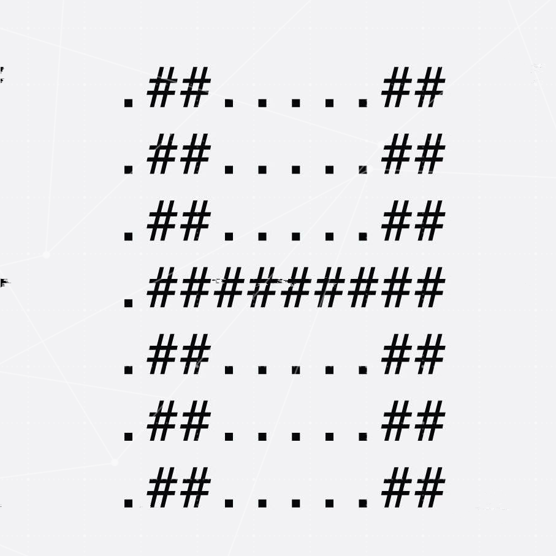

<link rel="stylesheet" href="https://cdnjs.cloudflare.com/ajax/libs/font-awesome/5.15.1/css/all.min.css" integrity="sha512-+4zCK9k+qNFUR5X+cKL9EIR+ZOhtIloNl9GIKS57V1MyNsYpYcUrUeQc9vNfzsWfV28IaLL3i96P9sdNyeRssA==" crossorigin="anonymous" />

  
  <nav style="display: flex; justify-content: center;">
    <a href="#about">About</a> |
    <a href="#registration">Registration</a> |
    <a href="#sponsors">Sponsors</a> |
    <a href="#team">Team</a> |
    <a href="#location">Location</a>
  </nav>

  

## About

  [Information about the contest here]

## Registration

  <a href="[URL for registration]" style="background-color: yellow; color: #333; padding: 0.5em 1em; text-decoration: none;">
    Register
  </a>

## Sponsors

  

    
    
    <!-- Add additional sponsor logos as needed -->
  

## Team

  

    

      
      

        <a href="#">
          <i class="fab fa-facebook"></i>
        </a>
        <a href="#">
          <i class="fab fa-linkedin"></i>
        </a>
        <a href="#">
          <i class="fab fa-twitter"></i>
        </a>
      

      
      

        <a href="#">
          <i class="fab fa-facebook"></i>
        </a>
        <a href="#">
          <i class="fab fa-linkedin"></i>
        </a>
        <a href="#">
          <i class="fab fa-twitter"></i>
        </a>
      

    

## Location

    <iframe src="https://www.google.com/maps/embed?pb=!1m18!1m12!1m3!1d1499.0533759109724!2d35.992137119432456!3d32.49245383802073!2m3!1f0!2f0!3f0!3m2!1i1024!2i768!4f13.1!3m3!1m2!1s0x151b89de9c0344a1%3A0xe043c4900b5e924b!2sJUST%20Gym!5e0!3m2!1sen!2sjo!4v1675435017362!5m2!1sen!2sjo" style="border:0; width: 100%; height: 20em;" allowfullscreen="" loading="lazy" referrerpolicy="no-referrer-when-downgrade"></iframe>

